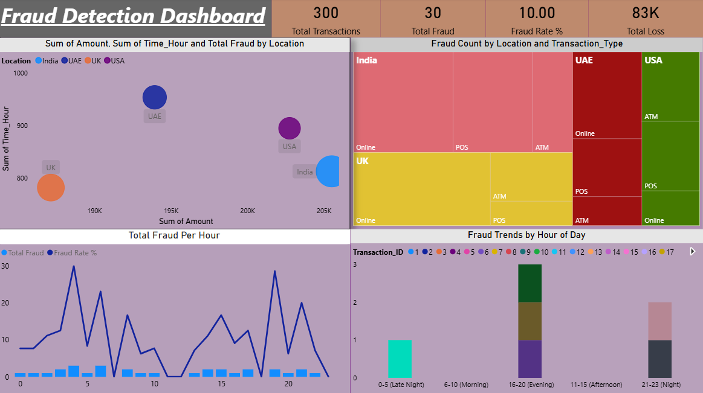

# Fraud Detection Dashboard (Power BI)

An interactive dashboard analyzing fraudulent transaction patterns across location, transaction type, and time of day — built to answer *when* and *where* fraud is most likely to occur, not just how much of it happened.

---

## Dashboard Preview

---

## Business Questions This Answers

- What proportion of transactions are fraudulent, and how much does that cost?
- Which times of day carry the highest fraud risk?
- Which countries/locations and transaction channels (Online, POS, ATM) see the most fraud?
- Is there a relationship between transaction amount, time of day, and fraud volume?

---

##  Key Insights

- **300 total transactions analyzed, 30 flagged as fraudulent** — a **10% fraud rate**, resulting in a **total loss of ₹83K** (~₹2.7K average loss per fraudulent transaction)
- **Fraud is concentrated in the evening and night**: the 16–20 hr (evening) and 21–23 hr (night) windows account for the large majority of flagged transactions, while the 11–15 hr (afternoon) window shows almost none — a clear signal for when fraud monitoring should be tightened
- **USA and UK show the highest fraud counts** on the location breakdown, spread fairly evenly across Online, POS, and ATM channels, while India and UAE show comparatively smaller concentrations
- **Higher transaction amounts show some association with fraud** on the scatter view — worth flagging transactions above a certain amount threshold for extra review, particularly outside business hours

---

##  What's on the Dashboard

- **KPI Cards**: Total Transactions, Total Fraud, Fraud Rate %, Total Loss
- **Scatter Chart**: Transaction amount vs. time of day, bubble size by fraud volume, broken out by location
- **Treemap**: Fraud count by Location and Transaction Type (Online/POS/ATM)
- **Combo Chart** (line + column): Total Fraud Per Hour, with Fraud Rate % overlay
- **Stacked Column Chart**: Fraud Trends by Hour-of-Day group (Late Night / Morning / Afternoon / Evening / Night)

---

##  Tools & Techniques

- **Power BI** — data modeling, DAX measures (Fraud Rate %, Total Loss)
- **Chart selection strategy**: used a scatter chart specifically to explore whether fraud correlates with transaction amount and timing (not just counts), and a stacked column by time-group to make the evening/night risk window immediately visible to a non-technical stakeholder

---

##  Files

- `fraud-detection.pbix` — the Power BI file
- `fraud-detection-screenshot.png` — dashboard preview

---

##  How to View

1. Download `fraud-detection.pbix`
2. Open in [Power BI Desktop](https://powerbi.microsoft.com/desktop/) (free)
3. Use the Location and Transaction_ID legends to filter and explore specific segments

---

