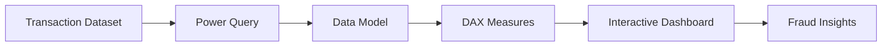

<div align="center">

# 🛡 Fraud Detection Analytics Dashboard

### Enterprise Fraud Intelligence Dashboard using Microsoft Power BI

*An interactive Business Intelligence solution designed to analyze fraudulent transaction patterns, identify high-risk behaviors, and support data-driven fraud prevention through advanced visual analytics.*


</div>

---

# 📖 Overview

Financial fraud remains one of the biggest challenges faced by banks, payment processors, and digital financial platforms. Detecting suspicious activity requires more than simply counting fraudulent transactions—it demands understanding **when**, **where**, and **how** fraudulent behavior occurs.

This Power BI dashboard transforms transactional data into actionable business intelligence by analyzing fraud trends across locations, transaction channels, transaction values, and time periods. The interactive report enables analysts to identify risk patterns, monitor fraud exposure, and support informed fraud mitigation strategies.

---

# ✨ Dashboard Features

## 📊 Executive KPI Dashboard

Provides an instant overview of fraud performance including:

- Total Transactions
- Total Fraud Cases
- Fraud Rate (%)
- Total Financial Loss

---

## 🌍 Geographic Fraud Analysis

Visualizes fraud distribution across different countries.

Enables analysts to identify:

- High-risk regions
- Geographic fraud concentration
- Regional fraud comparison
- Cross-country transaction patterns

---

## 💳 Transaction Channel Analysis

Compares fraud across transaction types including:

- Online Transactions
- POS Transactions
- ATM Transactions

Helps determine which payment channels experience the highest fraud activity.

---

## ⏰ Time-Based Fraud Detection

Analyzes fraud occurrence throughout the day to identify periods of elevated risk.

Supports:

- Hourly fraud monitoring
- Time-of-day risk analysis
- Fraud trend visualization
- Operational monitoring

---

## 💰 Transaction Value Analysis

Scatter plot visualization explores relationships between:

- Transaction Amount
- Fraud Occurrence
- Time of Day
- Geographic Location

Useful for identifying high-value transactions that may require additional verification.

---

## 🎛 Interactive Filtering

Users can explore fraud patterns dynamically using interactive report visuals and slicers.

---

# 🏗 Dashboard Architecture



---

# 📸 Dashboard Preview

<p align="center">

</p>

---

# 🚀 Engineering Highlights

### ✔ Interactive Fraud Intelligence

Designed for exploratory fraud analysis using interactive Power BI visuals.

---

### ✔ Strategic Data Visualization

Visualizations were selected to maximize analytical insight.

Examples include:

- Scatter Chart for analyzing fraud against transaction amount and time.
- Treemap for geographic and transaction channel distribution.
- Combo Chart for comparing hourly fraud volume with fraud rate.
- Stacked Column Chart for identifying daily fraud patterns.

---

### ✔ DAX-Based Analytics

Business metrics include:

- Fraud Rate (%)
- Total Financial Loss
- Fraud Count
- Transaction KPIs

---

### ✔ Executive Reporting

Dashboard designed to support fraud analysts, compliance teams, and business decision-makers through clear, actionable insights.

---

# 📊 Business Questions Answered

The dashboard enables stakeholders to answer questions such as:

- What percentage of transactions are fraudulent?
- What is the total financial impact of fraud?
- Which countries experience the highest fraud activity?
- Which transaction channels present the greatest risk?
- During which hours does fraud occur most frequently?
- Is there a relationship between transaction amount and fraud?

---

# 📈 Key Business Insights

| Insight | Finding |
|----------|----------|
| Transactions Analyzed | 300 |
| Fraud Cases | 30 |
| Fraud Rate | 10% |
| Total Financial Loss | ₹83K |
| Average Loss per Fraud | ~₹2.7K |
| Highest Risk Period | Evening & Night |
| Highest Fraud Locations | USA & UK |

---

# 🛠 Technologies Used

| Layer | Technology |
|---------|------------|
| BI Tool | Microsoft Power BI |
| Data Modeling | Power Query |
| Calculations | DAX |
| Visualization | Interactive Reports |
| Analytics | Fraud Intelligence |

---

# 📂 Project Structure

```text
Fraud-Detection-Dashboard
│
├── fraud_dashboard.pbix
├── fraud-detection-screenshot.png
└── README.md
```

---

# 🎯 What This Project Demonstrates

✅ Power BI Development

✅ Business Intelligence

✅ Fraud Analytics

✅ Interactive Dashboard Design

✅ DAX Calculations

✅ KPI Reporting

✅ Data Visualization

✅ Executive Reporting

✅ Data Storytelling

---

# ⚙ Getting Started

Clone the repository

```bash
git clone https://github.com/yourusername/fraud-detection-dashboard.git
```

Open the project using **Microsoft Power BI Desktop**.

Interact with the dashboard to explore fraud patterns across transaction channels, locations, and time periods.

---

# 💡 Why This Project?

The objective was to develop more than a standard reporting dashboard.

This project demonstrates how Business Intelligence techniques can uncover meaningful fraud patterns by combining interactive visualizations, DAX calculations, and analytical reporting. The dashboard helps transform raw transaction data into actionable insights that support fraud detection, operational monitoring, and risk-based decision-making.

---

<div align="center">

### ⭐ If you found this project useful, consider giving it a star!

Turning transactional data into actionable fraud intelligence through modern Business Intelligence.

</div>
